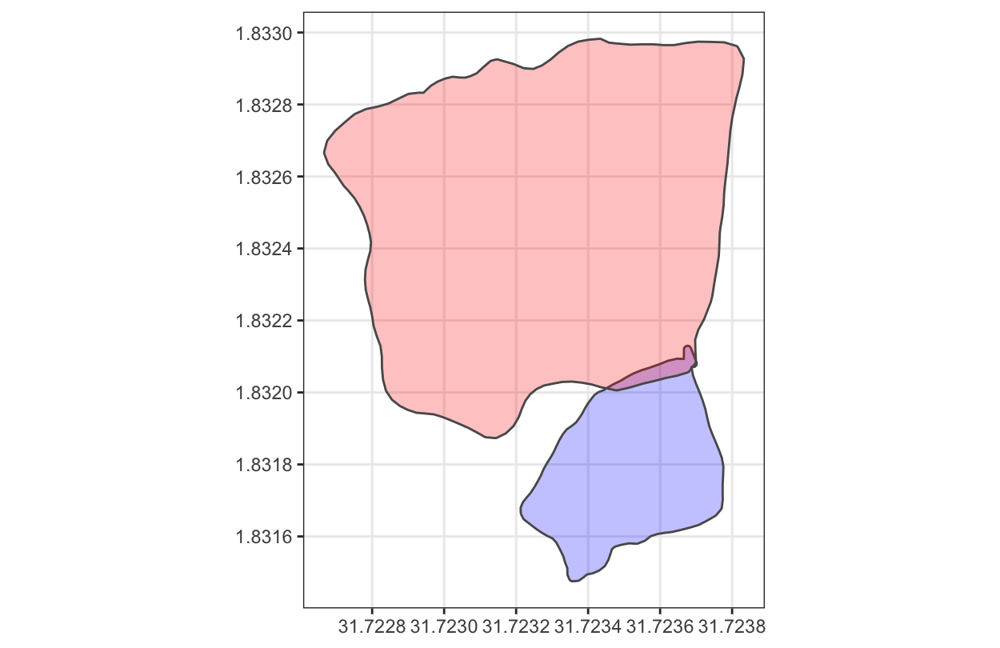
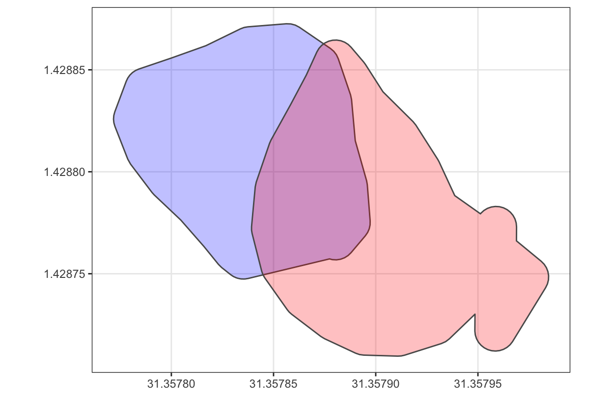
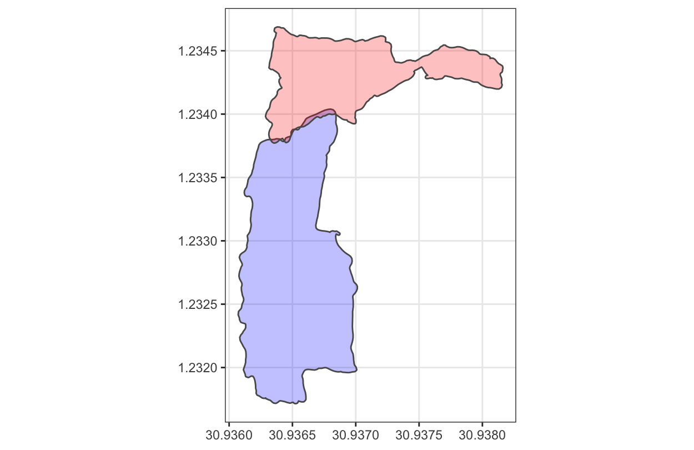

# Taking Root Data Analyst Take Home Exercise

One challenge we face with quantifying carbon is when our client’s staff go out and trace farms, they sometimes have overlapping areas. These overlaps can be due to GPS errors if they’re small, or they could just be unclear farm boundaries. Here are some examples:

Figure A (Small Overlap Example)

Figure B (Partial Overlap)

Figure C (Nearly complete Overlap)

Figure D: More complicated overlaps

Note: These examples are purposely not exhaustive of all possible situations. But they should give you an idea of the challenge.

The primary issue here is that we always want to avoid “double-counting” carbon. Our field survey carbon estimates currently are based on sampling part of a farm and extrapolation based on the proportion sampled. So if there is an overlap, that area would count twice with our current methods. Double-counting leads to overestimation of carbon, which leads to inaccuracies and can jeopardize our credibility in the market. There are other operational issues that overlaps cause as well, as they could lead to staff collecting data inefficiently.

In some circumstances, we will have clients go back out to the field and remap a farm. However, as you might imagine it’s expensive and time-consuming for clients to do that. So we try to avoid that when possible. If there are small overlaps, we can correct them manually on an adhoc basis. Ultimately, project managers on our reforestation team work with our partners to  decide if parcels need to be edited, ignored, remapped, or deleted

We want you to design a report or dashboard for a sample project.

The purpose of the report or dashboard would be to review newly collected data with potential quality issues and help a project manager create an action plan with a partner to fix these issues.

Specifically, this report should:
1) Identify all the overlaps
2) Quantify the extent of overlaps
3) Identify these issues in a clear and actionable way. This report should include some quantitative metrics as well as some data visualizations that a non-technical audience (project managers) should be able to understand
4) Propose further data collection and analysis that you would think would be useful to understand these issues better with an eye toward improving operations.
5) Present your findings and analysis to an interview panel in 20-minutes

Sample data in the form of a csv file is available `data` folder, which is a set of parcels that have at least some intersections:

[Link to Sample Data](./data/sample-data.csv)

Note it’s in WKT format and you can assume that it’s WGS 84

Additional Requirements:
1) All code must be in Python and well-documented.

2) For your presentation, you’re welcome to use whatever format you’d like. It could be a notebook (e.g., iPython), a powerpoint-style presentation, or an interactive dashboard.  Be creative and use whatever you’re most comfortable with.

3) Please share your code ahead of time by creating a pull request in this repository. Make sure to add any instructions needed to run your code.

